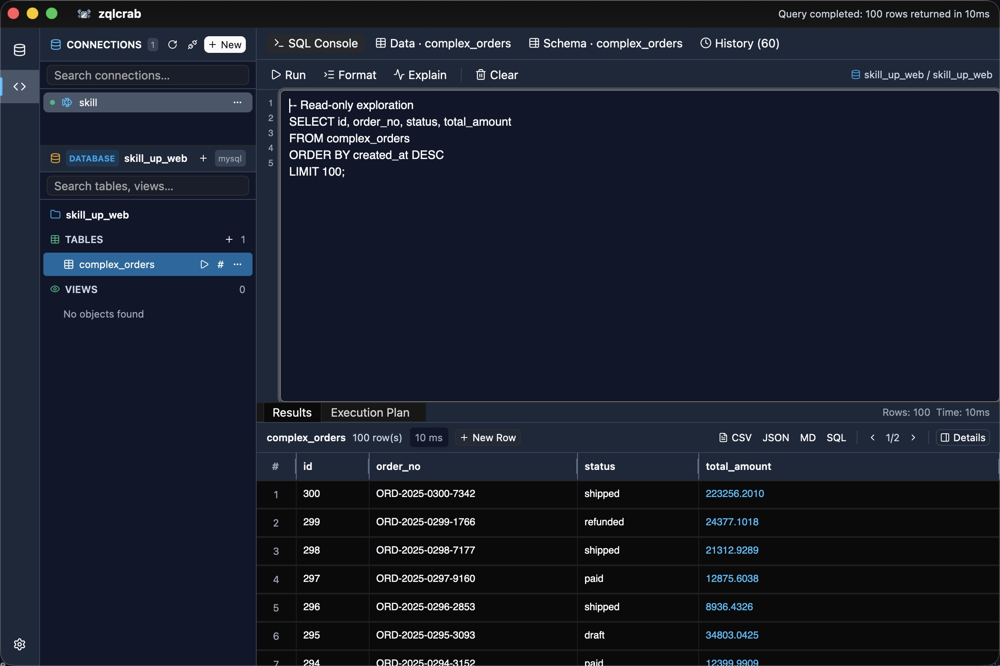
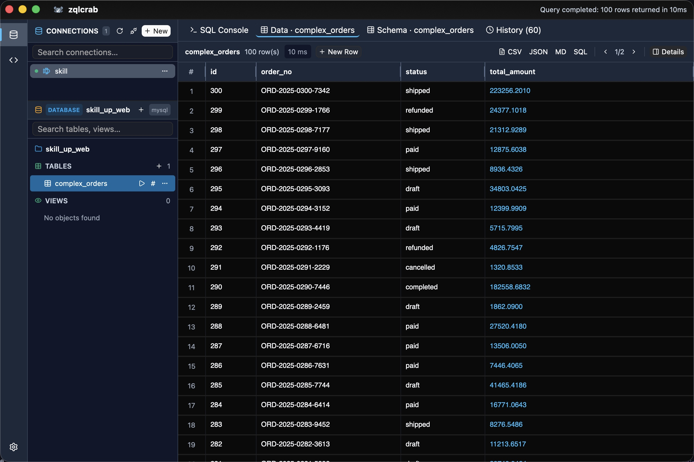
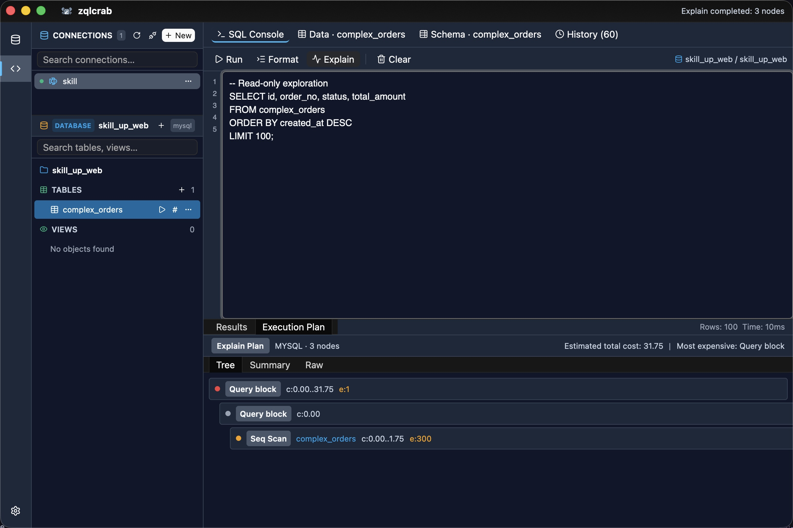
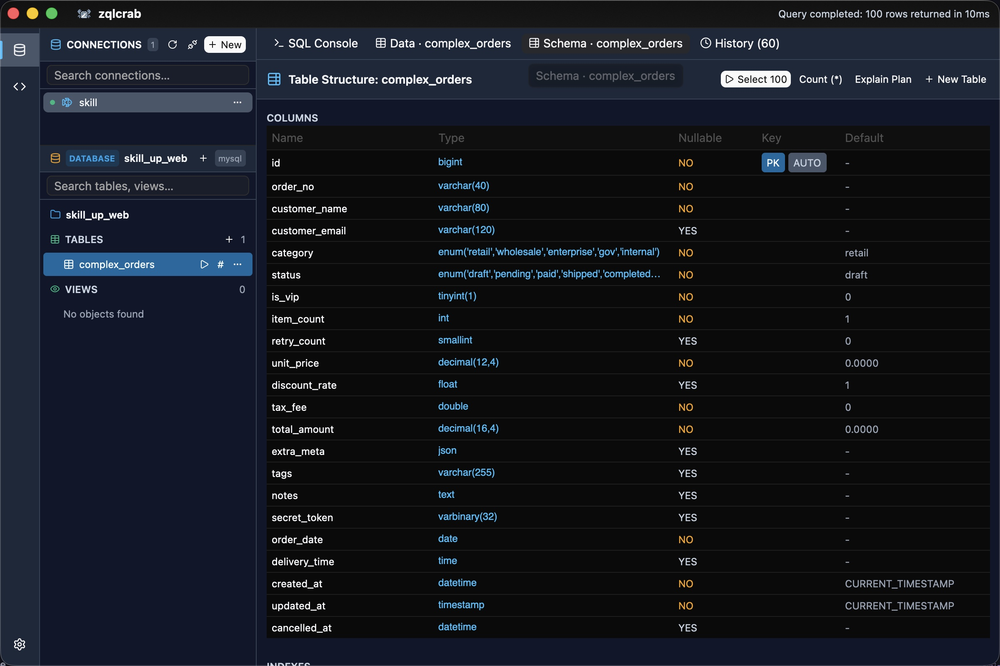
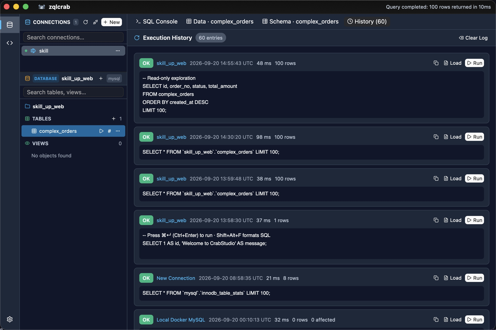
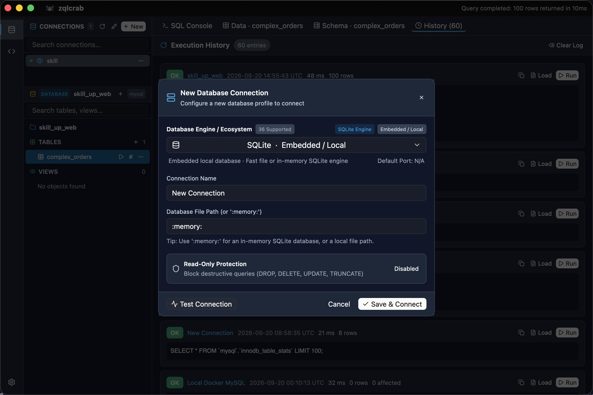

<p align="center">
  
</p>

<h1 align="center">zqlcrab</h1>

<p align="center">
  <strong>Fast, lightweight, GPU-accelerated database desktop client built with Rust & GPUI</strong>
</p>

<p align="center">
  <a href="https://github.com/hyzwhu/zqlcrab/releases"></a>
  <a href="LICENSE-APACHE"></a>
  
  
  
</p>

<p align="center">
  <strong>English</strong> | <a href="README_zh.md">简体中文</a>
</p>

---

**zqlcrab** is a modern, high-performance database desktop client engineered in Rust using [GPUI](https://github.com/zed-industries/zed) and [gpui-kit](https://github.com/longbridge/gpui-kit). Designed for software developers, DBAs, and data engineers who value speed, responsive zero-latency input, and a polished developer experience without webview or Electron overhead.

<p align="center">
  
</p>

---

## 📸 Screenshots

| SQL Console & Split Plan | Data Grid & Inspector |
| :---: | :---: |
|  |  |
| **Visual EXPLAIN Query Plan** | **Interactive Schema Viewer** |
|  |  |
| **Query History & Search** | **Connection Profiles & Diagnostics** |
|  |  |

---

## ✨ Features

- ⚡ **GPU-Accelerated 120 FPS UI**: Powered by Zed's GPUI framework. Instant startup, sub-millisecond input response, and minuscule memory consumption.
- 🔌 **Multi-Engine Relational Database Connectivity**:
  - **SQLite**: Bundled with WAL mode, in-memory databases, and file explorer integration.
  - **PostgreSQL**: Asynchronous client driver supporting TLS/SSL, schemas, and connection pools.
  - **MySQL**: Full async driver lifecycle, schema reflection, and multi-statement transactions.
  - **Catalog Selector**: Extensible database catalog supporting 36+ database engine connection profiles and custom driver adapters.
- 🎨 **Visual Table Designer**:
  - Intuitive schema creation dialog with real-time dialect DDL preview (PostgreSQL, MySQL, SQLite).
  - Column configuration: Primary Key, Auto Increment / Serial, Nullable, Default Values, and Column Comments.
  - Interactive Index Designer: Create normal or unique multi-column indexes with quick-pick chips and searchable column dropdowns.
  - Direct execution or "Open in Console" for customized DDL adjustments.
- 📊 **Interactive Data Grid & In-Place Editing**:
  - Double-click cell editing with immediate visual dirty-state markers.
  - Insert new blank rows or clone existing rows as starting templates.
  - Contextual row deletion with visual strike-through tracking.
  - **Staged Changeset Review**: Review all pending INSERTs, UPDATEs, and DELETEs in an atomic transaction script before committing to disk.
- ✨ **Visual Mock Data Generator & Seeder**:
  - Heuristic semantic type inference (names, emails, phones, UUIDs, ranges, timestamps, enums).
  - Multi-step interactive modal wizard with live preview of sample generated records.
  - Multi-dialect atomic batch insertion engine with progress tracking and automatic grid refresh.
- 🚀 **Comprehensive Data Export & Table Dump**:
  - Multi-format dump engine supporting SQL Scripts (DDL + batch multi-row INSERTs), CSV, TSV, JSON, NDJSON, and Markdown tables.
  - Dialect-aware options, WHERE filtering, row limits, file manager reveal, and clipboard export.
- 💻 **SQL Console & Developer Ergonomics**:
  - Multi-line query editor with execution history tracking and search.
  - One-click query formatting via `sqlformat`.
  - Visual query execution plan tree viewer (`EXPLAIN` / `EXPLAIN QUERY PLAN`).
  - Read-only safe mode toggle to protect production instances from accidental writes.
  - Fast result export to **CSV**, **JSON**, **Markdown**, and **SQL INSERT** statements.
- 🗄️ **Persistent Connection Profiles & Session Restore**:
  - Secure local configuration (`~/.config/zqlcrab/connections.json` or macOS `Application Support`).
  - True persistence lifecycle: deleted profiles stay deleted without unwanted default presets reinjected on restart.
  - Automatic reconnection to your last active database profile across sessions.
  - Latency ping indicator, test connection diagnostics, and instant database switching.
- 🖥️ **macOS Native Integration & Responsive Layout**:
  - Native macOS menu bar (`zqlcrab`, `File`, `Edit`, `View`, `Window`, `Help`) with keyboard shortcuts.
  - Fluid titlebar navigation that gracefully collapses and preserves critical action controls on smaller screens.
  - Dark obsidian and crisp light themes with high-contrast UI tokens.

---

## 🚀 Getting Started

### Pre-built Binaries

Download pre-compiled release packages for your operating system from [GitHub Releases](https://github.com/hyzwhu/zqlcrab/releases):

| OS | Architecture | Package |
| :--- | :--- | :--- |
| **macOS** | Apple Silicon (M1/M2/M3/M4/M5) | `zqlcrab-aarch64-apple-darwin.dmg` / `.tar.gz` |
| **macOS** | Intel x86_64 | `zqlcrab-x86_64-apple-darwin.dmg` / `.tar.gz` |
| **Linux** | x86_64 | `zqlcrab-x86_64-unknown-linux-gnu.tar.gz` |
| **Linux** | ARM64 / aarch64 | `zqlcrab-aarch64-unknown-linux-gnu.tar.gz` |
| **Windows** | x86_64 | `zqlcrab-x86_64-pc-windows-msvc.zip` |
| **Windows** | ARM64 / aarch64 | `zqlcrab-aarch64-pc-windows-msvc.zip` |

---

### Building from Source

#### Prerequisites
- Rust toolchain (version 1.85+ recommended, 2024 edition compatible):
  ```bash
  curl --proto '=https' --tlsv1.2 -sSf https://sh.rustup.rs | sh
  ```

#### 1. Clone the Repository
```bash
git clone https://github.com/hyzwhu/zqlcrab.git
cd zqlcrab
```

#### 2. Platform Dependencies & Installation

##### macOS
Download the `.dmg` package from [Releases](https://github.com/hyzwhu/zqlcrab/releases), open it, and drag `zqlcrab` into your `Applications` folder.

> **⚠️ macOS Gatekeeper Notice ("App is damaged and can't be opened"):**  
> Because zqlcrab is an open-source binary distributed without Apple Developer ID notarization, macOS Gatekeeper may quarantine the application on first launch. To resolve this, open **Terminal** and run:
> ```bash
> sudo xattr -rd com.apple.quarantine /Applications/zqlcrab.app
> ```
> Alternatively, open the `复制修复命令.txt` file inside the DMG installer window to copy the exact command.

Build from source:
```bash
cargo build --release
```

##### Linux (Ubuntu / Debian / Arch / Fedora)
Install X11, Wayland, and font development packages:
```bash
# Ubuntu / Debian
sudo apt-get update && sudo apt-get install -y \
    pkg-config libssl-dev libx11-dev libxcb1-dev \
    libxcb-render0-dev libxcb-shape0-dev libxcb-xfixes0-dev \
    libxkbcommon-dev libxkbcommon-x11-dev libasound2-dev \
    libfontconfig1-dev libfreetype6-dev libvulkan1

# Arch Linux
sudo pacman -S fontconfig freetype2 libx11 libxkbcommon wayland mesa
```

##### Windows
Install [Visual Studio C++ Build Tools](https://visualstudio.microsoft.com/visual-cpp-build-tools/) with the Windows SDK component.

#### 3. Run
```bash
cargo run --release
```

---

## ⌨️ Keyboard Shortcuts & Native Menus

`zqlcrab` provides a full native macOS menu bar (`zqlcrab`, `File`, `Edit`, `View`, `Window`, `Help`) and comprehensive keyboard shortcuts designed for high productivity:

### General & Window Management

| Shortcut (macOS) | Shortcut (Win / Linux) | Action |
| :--- | :--- | :--- |
| `⌘ + Q` | `Ctrl + Q` | **Quit application** |
| `⌘ + W` | `Ctrl + W` | **Close current modal / dialog / window** |
| `Esc` | `Esc` | Close active dialog or modal |
| `⌘ + ,` | `Ctrl + ,` | Open Settings & Preferences |
| `⌘ + M` | `Ctrl + M` | Minimize window |
| `⌃ + ⌘ + F` | `F11` | Toggle Full Screen |

### Navigation & Connections

| Shortcut (macOS) | Shortcut (Win / Linux) | Action |
| :--- | :--- | :--- |
| `⇧ + ⌘ + N` | `Ctrl + Shift + N` | Open New Connection dialog |
| `⌘ + T` | `Ctrl + T` | Switch to Query Console / New Tab |
| `⌘ + R` | `Ctrl + R` | Refresh tables and schema |
| `⌘ + 1` | `Ctrl + 1` | Switch to **Query Console** tab |
| `⌘ + 2` | `Ctrl + 2` | Switch to **Data Grid** tab |
| `⌘ + 3` | `Ctrl + 3` | Switch to **Table Schema** tab |
| `⌘ + 4` | `Ctrl + 4` | Switch to **Query History** tab |

### SQL Console & Execution

| Shortcut (macOS) | Shortcut (Win / Linux) | Action |
| :--- | :--- | :--- |
| `⌘ + ↵` | `Ctrl + Enter` | **Execute SQL Query** |
| `⌥ + ⇧ + F` | `Alt + Shift + F` | **Format SQL** (via `sqlformat`) |
| `⌘ + ⇧ + E` | `Ctrl + Shift + E` | **Explain Query Plan** (`EXPLAIN`) |

### Data Grid & In-Place Editing

| Shortcut (macOS) | Shortcut (Win / Linux) | Action |
| :--- | :--- | :--- |
| `⌘ + S` | `Ctrl + S` | **Review staged changes & Commit** (Atomic transaction) |
| `⌘ + N` | `Ctrl + N` | Insert blank new row |
| `⌘ + D` | `Ctrl + D` | Duplicate selected row as template |
| `⌘ + ⌫` | `Ctrl + Backspace` | Delete / discard selected row |

---

## 📂 Project Architecture

```
zqlcrab/
├── assets/                  # High-res logos, vectors, and database engine icons
├── src/
│   ├── main.rs              # Application entrypoint & GPUI window initialization
│   ├── db/                  # Database abstraction layer
│   │   ├── adapter.rs       # Async DatabaseAdapter trait
│   │   ├── changeset.rs     # Tabular grid mutation tracker (Insert/Update/Delete)
│   │   ├── sql_gen.rs       # Dialect DDL and atomic transaction generator
│   │   ├── explain.rs       # Query execution plan parser
│   │   ├── export.rs        # CSV, JSON, Markdown, and SQL formatters
│   │   ├── sqlite.rs        # SQLite engine implementation
│   │   ├── postgres.rs      # PostgreSQL client adapter
│   │   ├── mysql.rs         # MySQL async client adapter
│   │   └── types.rs         # Database metadata and value representations
│   └── ui/                  # GPUI user interface components
│       ├── app.rs           # Root application view & state machine
│       ├── theme.rs         # Theme tokens & obsidian color palette
│       └── components/      # Data grid, console, table designer, connection modal
└── .github/workflows/       # Automated CI and multi-platform release pipelines
```

---

## 🤝 Contributing

Contributions, bug reports, and feature suggestions are warmly welcomed!
1. Fork the repository
2. Create your feature branch (`git checkout -b feature/amazing-feature`)
3. Ensure tests pass (`cargo test`)
4. Commit your changes (`git commit -m 'feat: add amazing feature'`)
5. Push to the branch (`git push origin feature/amazing-feature`)
6. Open a Pull Request

---

## 📄 License

Licensed under the **Apache License, Version 2.0** ([LICENSE-APACHE](LICENSE-APACHE) or http://www.apache.org/licenses/LICENSE-2.0).
